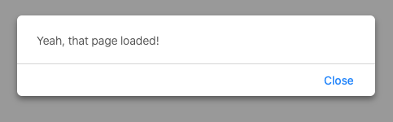
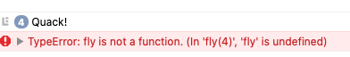

# HfJsChap11

All code from the book 'Headfirst Javascript' | Chapter 11

__________________________________________________________

load.html -> Example of using anonymous functions

__________________________________________________________

undeclrd.html -> Example of using anonymous functions, returning an undeclared variable

